# Getting Started with MCP

Welcome! This guide will help you get started learning about MCP servers.

## 🎯 Your Learning Journey

```mermaid
graph LR
    You([You are here]) --> Step1[📖 Read Basics]
    Step1 --> Step2[🏗️ Study Architecture]
    Step2 --> Step3[💻 Review Code]
    Step3 --> Step4[🚀 Try Examples]
    Step4 --> Step5[🔨 Build Your Own]

    style You fill:#e1f5ff
    style Step5 fill:#e1ffe1
```



## 📚 Documentation Structure

This project contains comprehensive learning materials organized as follows:

### 1. Start Here
- **[README.md](../README.md)** - Project overview and quick start
- **This file (GETTING-STARTED.md)** - Your roadmap

### 2. Core Concepts
- **[docs/concepts.md](concepts.md)** - Deep dive into MCP fundamentals
  - What are Tools, Resources, and Prompts
  - When to use each one
  - Best practices

### 3. Architecture
- **[docs/architecture.md](architecture.md)** - How everything works
  - System architecture diagrams
  - Communication flows
  - Request/response lifecycle

### 4. Visual Learning
- **[docs/visual-guide.md](visual-guide.md)** - Interactive diagrams
  - State machines
  - Flow charts
  - Mind maps

### 5. Practical Usage
- **[docs/usage.md](usage.md)** - How to use the server
  - Step-by-step examples
  - Common patterns
  - Troubleshooting
  - [Run in Inspect Mode (Browser UI)](usage.md#4-run-in-inspect-mode-browser-ui)

### 6. Quick Reference
- **[docs/quick-reference.md](quick-reference.md)** - Cheat sheet
  - All commands
  - All tools
  - JSON-RPC formats

### 7. Code
- **[src/index.ts](../src/index.ts)** - The actual server implementation
  - Heavily commented
  - Clear structure
  - Best practices

### 8. Examples
- **[examples/](../examples/)** - Practical examples
  - Client implementation
  - Usage patterns
  - Integration examples

## 🚀 Quick Setup (5 minutes)

### Prerequisites
- Node.js 18 or higher
- npm (comes with Node.js)
- A code editor (VS Code recommended)

### Installation

```bash
# 1. Navigate to the project
cd /path/to/mcp-server

# 2. Install dependencies
npm install

# 3. Build the project
npm run build

# 4. Verify it works
echo '{"jsonrpc":"2.0","method":"tools/list","id":1}' | node build/index.js
```

If you see a list of tools, you're all set! ✅

## 📖 Recommended Learning Order

### Day 1: Understanding (1-2 hours)
1. Read [README.md](../README.md) for overview
2. Read [concepts.md](concepts.md) to understand fundamentals
3. Browse [visual-guide.md](visual-guide.md) to see diagrams

### Day 2: Deep Dive (2-3 hours)
1. Study [architecture.md](architecture.md) in detail
2. Read through [src/index.ts](../src/index.ts) with comments
3. Review [usage.md](usage.md) for practical examples

### Day 3: Hands-On (2-4 hours)
1. Run the examples in [examples/](../examples/)
2. Try modifying the server (add a new tool)
3. Create your own simple MCP client

### Day 4: Building (4+ hours)
1. Design your own MCP server concept
2. Implement it using this project as a template
3. Test it with a real MCP client

## 🎓 Learning Paths by Background

### If you're new to programming:
1. Start with [concepts.md](concepts.md) - read slowly
2. Look at [visual-guide.md](visual-guide.md) for diagrams
3. Read [usage.md](usage.md) to see examples
4. Come back to [src/index.ts](../src/index.ts) after understanding concepts

### If you're a developer:
1. Skim [README.md](../README.md) for context
2. Jump to [architecture.md](architecture.md) for architecture
3. Read [src/index.ts](../src/index.ts) to see implementation
4. Try [examples/](../examples/) to practice

### If you're building an MCP server:
1. Review [architecture.md](architecture.md) for design patterns
2. Study [src/index.ts](../src/index.ts) as a reference
3. Use [quick-reference.md](quick-reference.md) as a cheat sheet
4. Reference [concepts.md](concepts.md) for best practices

### If you're building an MCP client:
1. Read [concepts.md](concepts.md) for protocol understanding
2. See [examples/client-example.ts](../examples/client-example.ts)
3. Use [usage.md](usage.md) for request/response formats
4. Keep [quick-reference.md](quick-reference.md) handy

## 🔍 Key Files Explained

| File | Purpose | When to Read |
|------|---------|--------------|
| `README.md` | Project overview | First |
| `docs/concepts.md` | Learn fundamentals | After README |
| `docs/architecture.md` | Understand internals | When ready to code |
| `docs/visual-guide.md` | See diagrams | Anytime for reference |
| `docs/usage.md` | Practical examples | When using the server |
| `docs/quick-reference.md` | Quick lookup | Keep open while coding |
| `src/index.ts` | Implementation | When building your own |
| `examples/client-example.ts` | Client code | When building a client |

## 💡 Learning Tips

### 1. Read Actively
Don't just read - take notes, draw diagrams, ask questions.

### 2. Experiment
Change the code and see what happens. Break things intentionally.

### 3. Build Something
The best way to learn is by building. Start small.

### 4. Use the Diagrams
The visual guide has many Mermaid diagrams. They help a lot!

### 5. Follow the Data
Trace how a request flows through the system from start to end.

## 🎯 Learning Objectives

By the end of this material, you should be able to:

- [ ] Explain what MCP is and why it exists
- [ ] Describe the difference between Tools, Resources, and Prompts
- [ ] Understand how JSON-RPC communication works
- [ ] Read and understand the server implementation
- [ ] Build your own basic MCP server
- [ ] Create an MCP client
- [ ] Debug MCP communication issues
- [ ] Design tools, resources, and prompts effectively

## 🧪 Test Your Understanding

After studying, try these challenges:

### Beginner
1. Add a new tool to count notes: `count_notes`
2. Add a resource: `notes://tags` that lists all unique tags
3. Modify a prompt to include different information

### Intermediate
1. Implement note categories (like folders)
2. Add a tool to export notes to JSON file
3. Create a new prompt for weekly note summaries

### Advanced
1. Add persistence using SQLite
2. Implement user authentication
3. Create a web-based MCP client
4. Add support for note attachments

## 🐛 Common Questions

### Q: What is stdio?
**A:** Standard input/output - how programs communicate via console. The server reads from stdin and writes to stdout.

### Q: Why JSON-RPC?
**A:** It's a simple, well-defined protocol for remote procedure calls that works well over any transport.

### Q: Can I use this in production?
**A:** This is an educational example. For production, add:
- Proper error handling
- Logging
- Database persistence
- Authentication
- Rate limiting
- Testing

### Q: How do I debug?
**A:** Add `console.error()` statements (they go to stderr, not interfering with the protocol on stdout).

### Q: What if I get stuck?
**A:**
1. Check the [usage.md](usage.md) troubleshooting section
2. Review relevant sections of [docs/](.)
3. Read the code comments in [src/index.ts](../src/index.ts)
4. Search for similar examples in [examples/](../examples/)

## 🔗 External Resources

### Official MCP Resources
- [MCP Website](https://modelcontextprotocol.io)
- [MCP Specification](https://spec.modelcontextprotocol.io)
- [MCP SDK on GitHub](https://github.com/modelcontextprotocol/sdk)

### Related Topics
- JSON-RPC 2.0 Specification
- JSON Schema
- TypeScript Documentation
- Node.js Streams

## 🎉 You're Ready!

Now that you have the roadmap, start with [concepts.md](concepts.md) and begin your MCP journey!

Remember:
- **Take your time** - There's a lot to learn
- **Experiment freely** - You can't break anything
- **Build projects** - Practical experience is best
- **Have fun** - MCP is powerful and exciting!

## 📝 Quick Start Checklist

- [ ] Install Node.js 18+
- [ ] Clone/download this project
- [ ] Run `npm install`
- [ ] Run `npm run build`
- [ ] Read [README.md](../README.md)
- [ ] Study [concepts.md](concepts.md)
- [ ] Review [architecture.md](architecture.md)
- [ ] Explore [src/index.ts](../src/index.ts)
- [ ] Try [examples/](../examples/)
- [ ] Build something new!

---

**Happy Learning! 🚀**

If you found this helpful, consider:
- ⭐ Starring the repository
- 📝 Contributing improvements
- 🐛 Reporting issues
- 💬 Sharing your projects

**Questions?** Review the documentation, try the examples, and experiment with the code!
