# MCP Architecture Guide

This document provides a deep dive into the Model Context Protocol architecture and how this server implements it.

## 🏛️ Overall Architecture

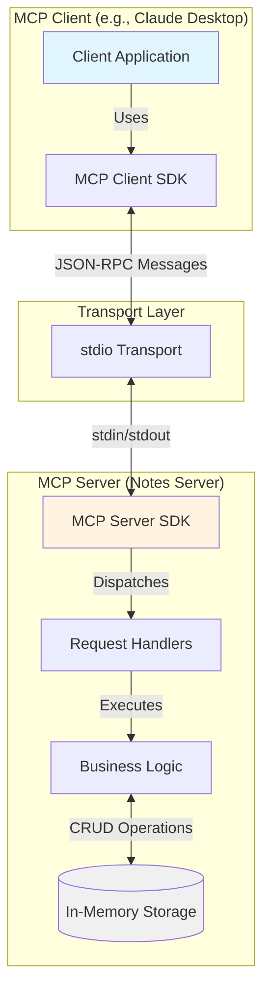

## 🔄 Communication Flow

### 1. Server Initialization

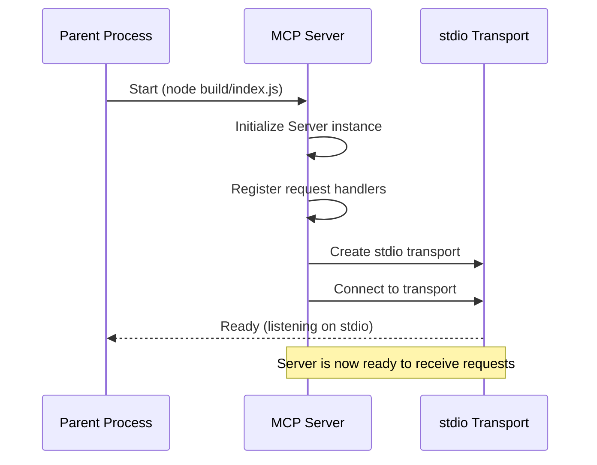

### 2. Tool Discovery Flow

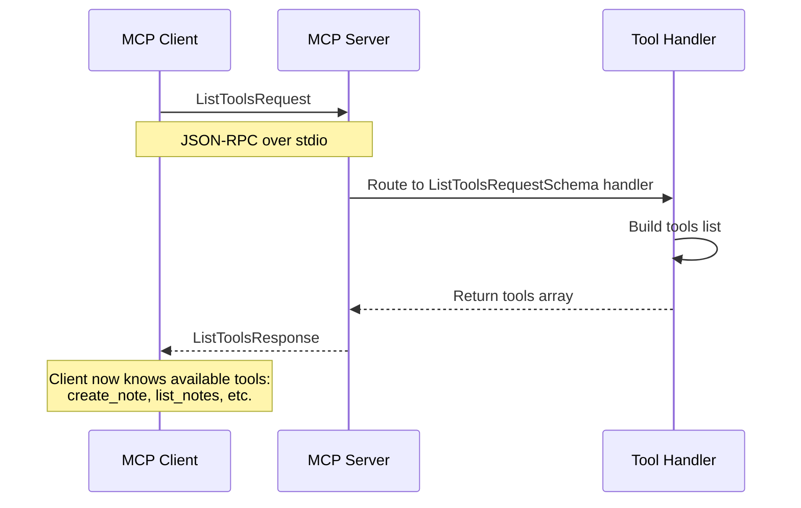

### 3. Tool Execution Flow

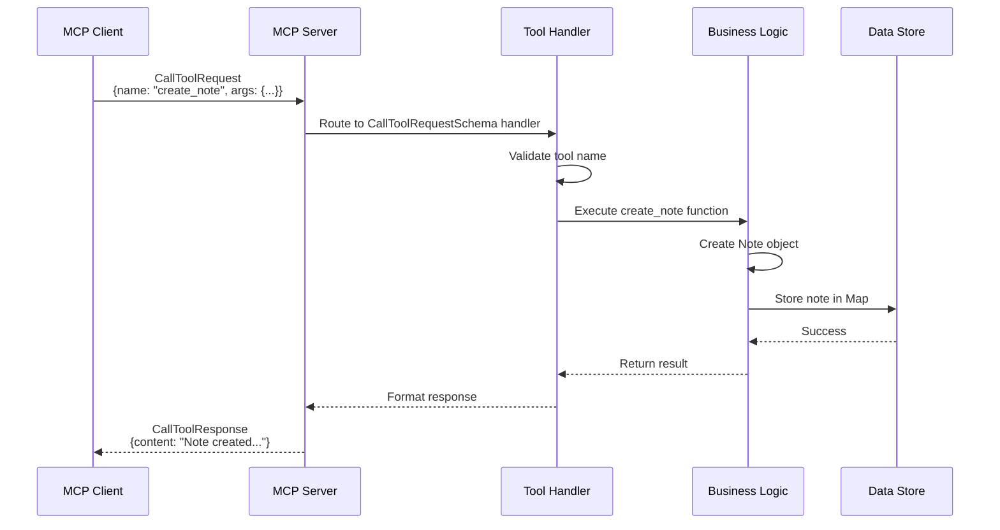

### 4. Resource Reading Flow

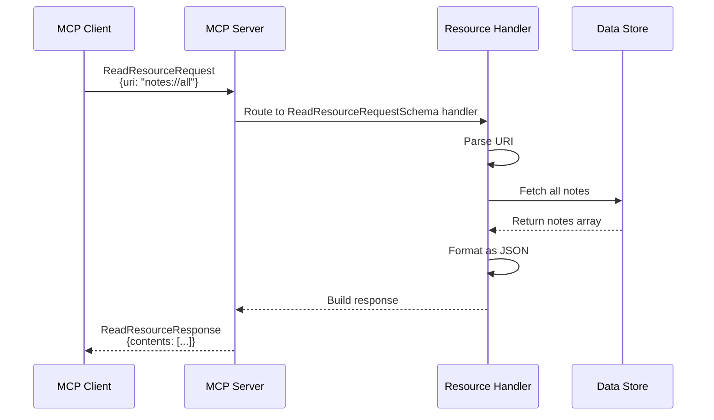

## 🧱 Component Architecture

### Server Core

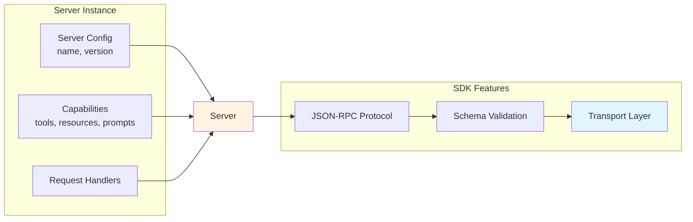

### Request Handler Architecture

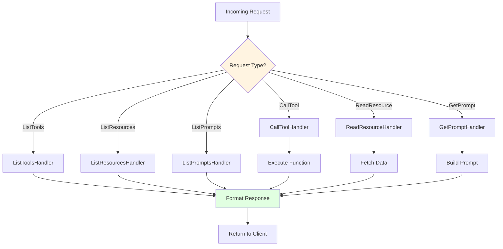

## 📊 Data Flow

### Tool Invocation Data Flow

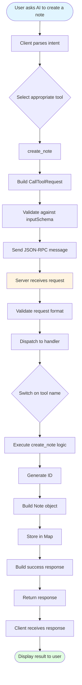

## 🔌 Protocol Details

### JSON-RPC Message Format

MCP uses JSON-RPC 2.0 for all communication:

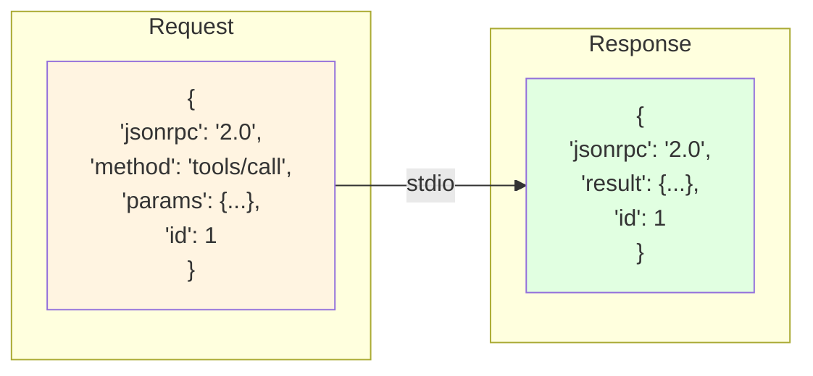

### Tool Schema Structure

```mermaid
graph TD
    Tool[Tool Definition] --> Name[name: string]
    Tool --> Desc[description: string]
    Tool --> Schema[inputSchema: JSONSchema]

    Schema --> Type[type: object]
    Schema --> Props[properties: {...}]
    Schema --> Req[required: string[]]

    Props --> Prop1[title: string]
    Props --> Prop2[content: string]
    Props --> Prop3[tags: string[]]

    style Tool fill:#fff4e1
    style Schema fill:#e1f5ff
```

## 🏗️ Implementation Layers

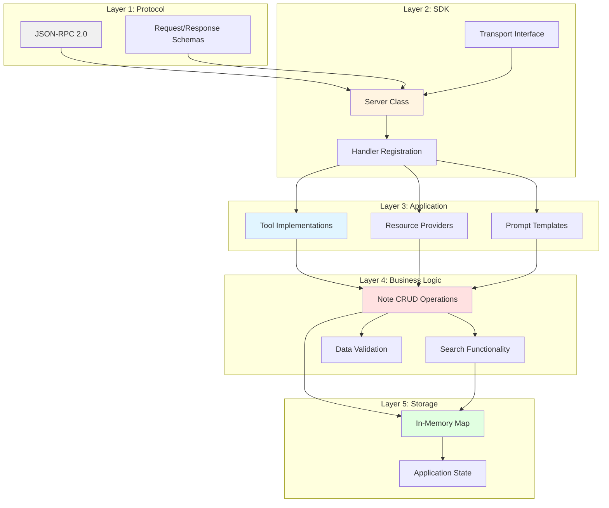

## 🔐 Security Considerations

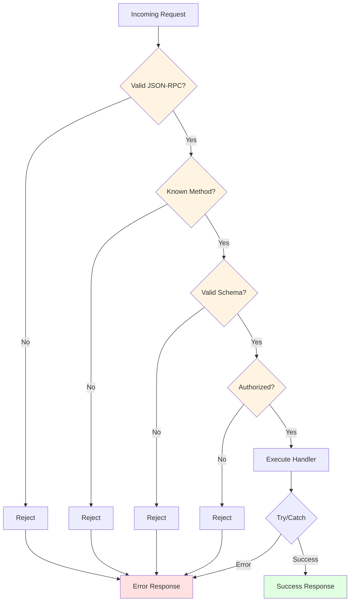

## 🎯 Design Patterns Used

### 1. Handler Pattern
Each request type has a dedicated handler function registered with the SDK.

### 2. Schema Validation
JSON Schema validates all inputs before processing.

### 3. Error Boundaries
Try-catch blocks prevent crashes and return proper error responses.

### 4. Separation of Concerns
- Protocol layer (SDK)
- Business logic (our code)
- Data storage (Map)

### 5. Type Safety
TypeScript ensures type correctness throughout the codebase.

## 📈 Scaling Considerations

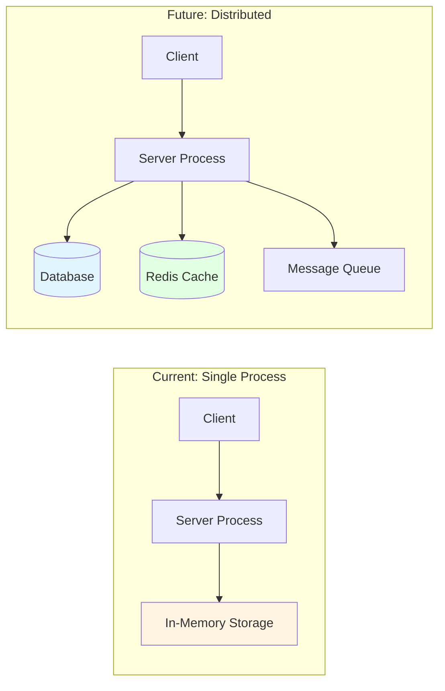

## 🔄 State Management

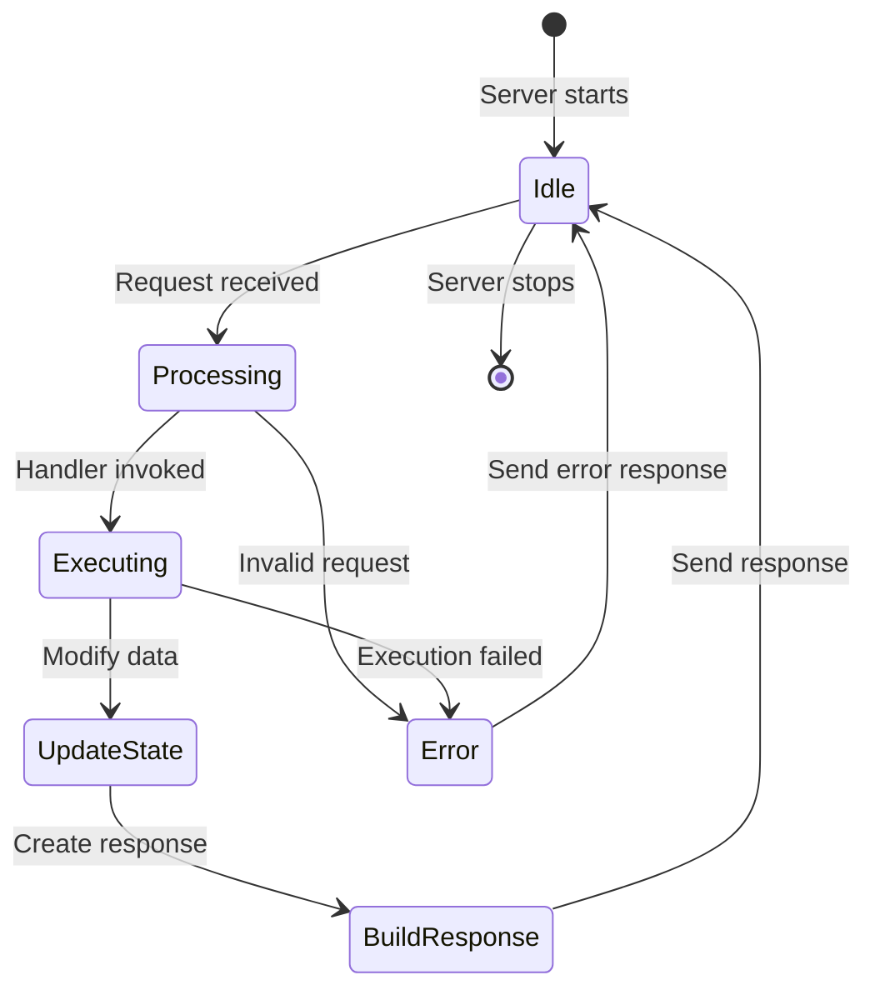

## 🧪 Testing Architecture

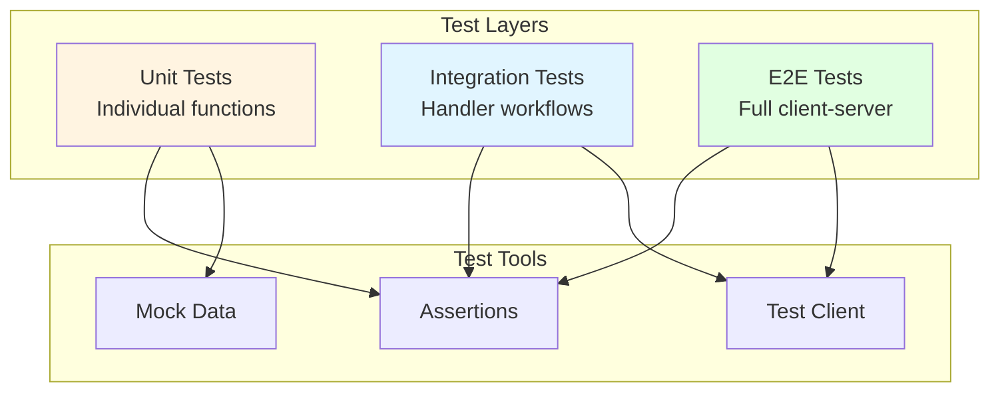

---

**Next**: Check out [concepts.md](concepts.md) for detailed explanations of MCP concepts, or [usage.md](usage.md) for practical examples!
