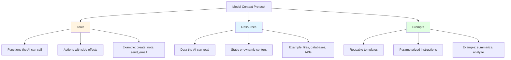
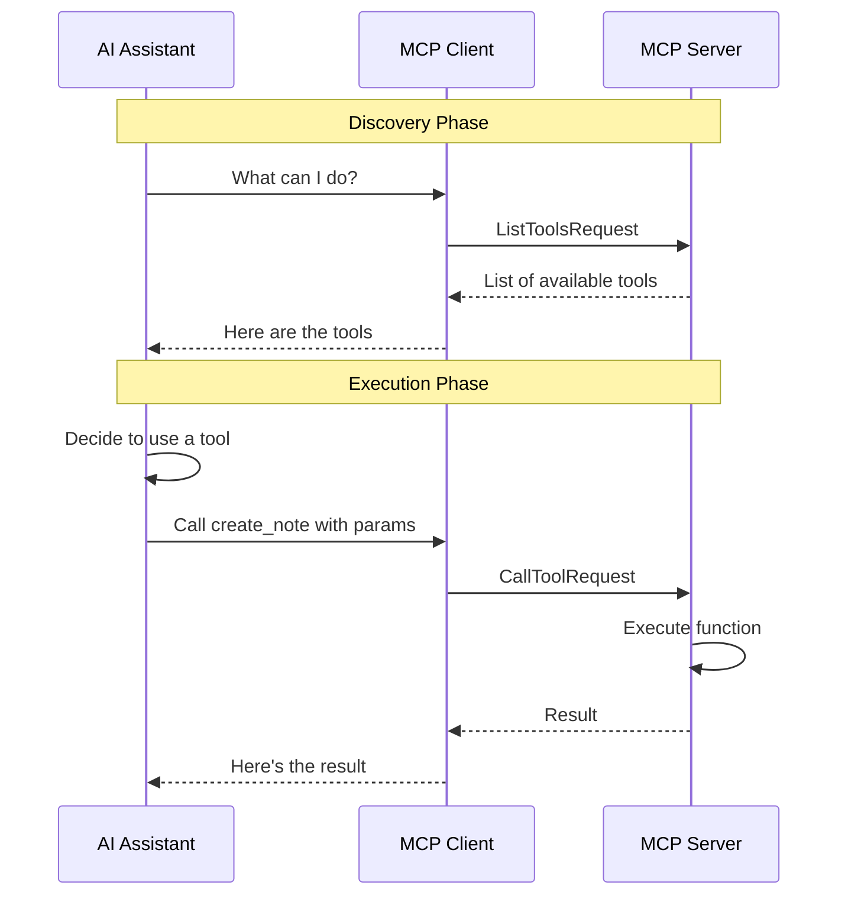
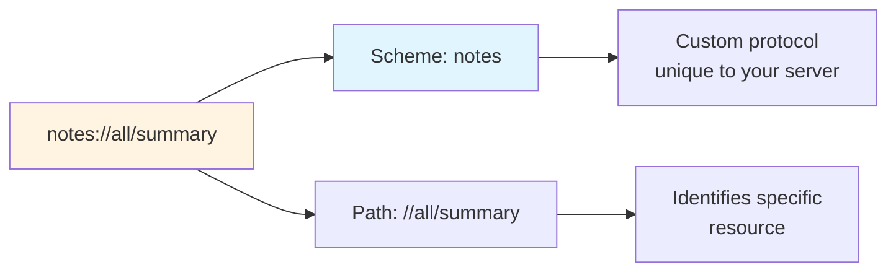
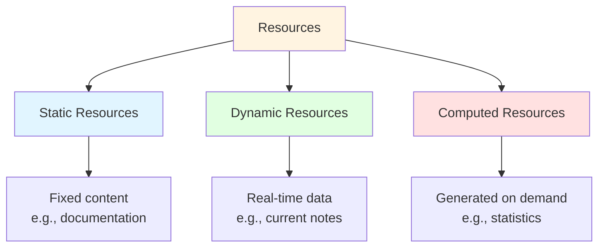
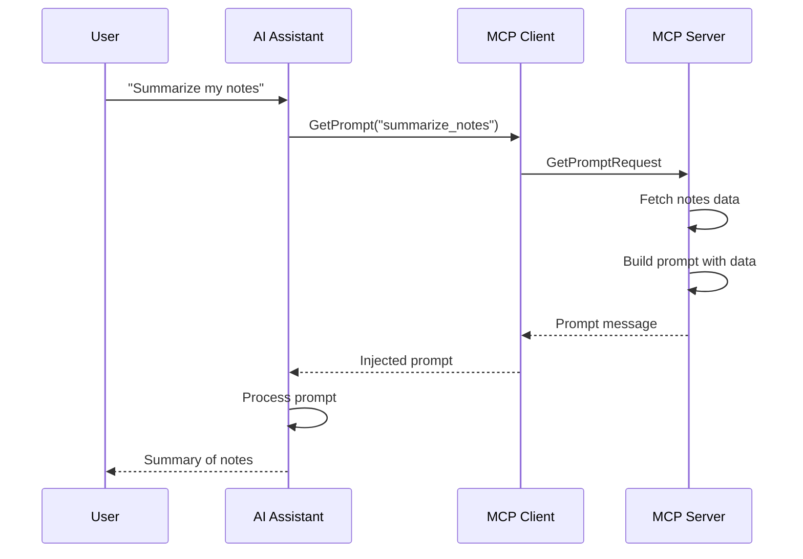
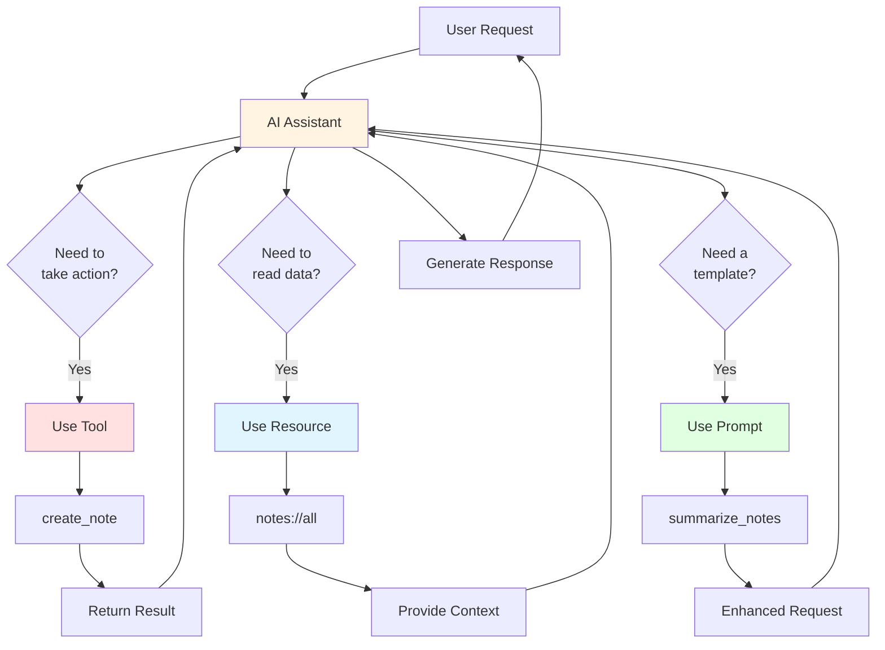
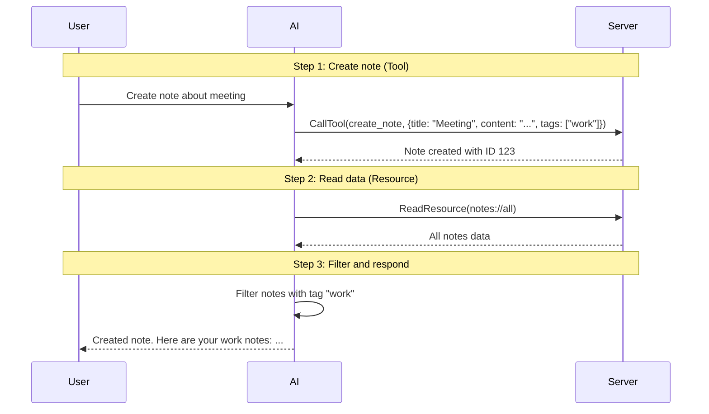
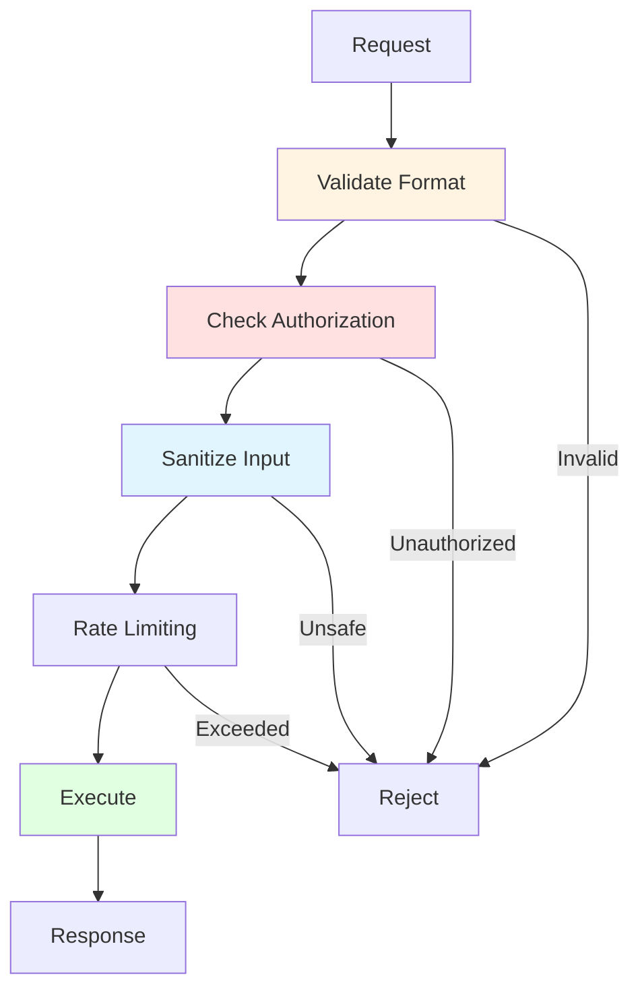

# MCP Core Concepts

This guide explains the fundamental concepts of the Model Context Protocol (MCP) in detail.

## 🎯 What Problem Does MCP Solve?

Before MCP, every tool or data source needed a custom integration with AI assistants. This led to:
- Duplication of effort
- Inconsistent interfaces
- Difficult maintenance
- Limited extensibility

MCP provides a **standard protocol** that any LLM application can use to communicate with any tool or data source.

## 🏗️ The Three Pillars of MCP



## 1️⃣ Tools

**Tools are functions that the AI can execute.** They represent actions with side effects or computations.

### Tool Structure

```typescript
{
  name: string,           // Unique identifier
  description: string,    // What the tool does
  inputSchema: {          // JSON Schema for parameters
    type: "object",
    properties: {...},
    required: [...]
  }
}
```

### Tool Lifecycle



### Example: create_note Tool

```typescript
// Schema Definition
{
  name: "create_note",
  description: "Create a new note with a title, content, and optional tags",
  inputSchema: {
    type: "object",
    properties: {
      title: { type: "string", description: "The title of the note" },
      content: { type: "string", description: "The content/body of the note" },
      tags: {
        type: "array",
        items: { type: "string" },
        description: "Optional tags to categorize the note"
      }
    },
    required: ["title", "content"]
  }
}

// Implementation
async function handleCreateNote(args) {
  const id = Date.now().toString();
  const note = {
    id,
    title: args.title,
    content: args.content,
    tags: args.tags || [],
    createdAt: new Date().toISOString(),
    updatedAt: new Date().toISOString()
  };
  notes.set(id, note);
  return `Note created successfully with ID: ${id}`;
}
```

### When to Use Tools

✅ **Use tools for:**
- Creating, updating, or deleting data
- Performing calculations
- Making API calls
- Executing commands
- Any action with side effects

❌ **Don't use tools for:**
- Just reading static data (use Resources)
- Providing conversation templates (use Prompts)

## 2️⃣ Resources

**Resources are data that the AI can read.** They provide context without side effects.

### Resource Structure

```typescript
{
  uri: string,           // Unique identifier (e.g., "notes://all")
  mimeType: string,      // Content type (e.g., "application/json")
  name: string,          // Human-readable name
  description: string    // What the resource contains
}
```

### Resource URI Scheme



### Resource Types



### Example: Notes Resources

```typescript
// List available resources
{
  resources: [
    {
      uri: "notes://all",
      mimeType: "application/json",
      name: "All Notes",
      description: "Complete list of all notes in the system"
    },
    {
      uri: "notes://summary",
      mimeType: "text/plain",
      name: "Notes Summary",
      description: "A summary of notes with statistics"
    }
  ]
}

// Reading a resource
async function handleReadResource(uri) {
  if (uri === "notes://all") {
    return {
      contents: [{
        uri,
        mimeType: "application/json",
        text: JSON.stringify(Array.from(notes.values()), null, 2)
      }]
    };
  }
}
```

### When to Use Resources

✅ **Use resources for:**
- Exposing existing data
- Providing read-only access
- Sharing files or documents
- Offering API responses
- Database queries (read-only)

❌ **Don't use resources for:**
- Actions that modify data (use Tools)
- Interactive prompts (use Prompts)

## 3️⃣ Prompts

**Prompts are reusable templates for AI interactions.** They help standardize common tasks.

### Prompt Structure

```typescript
{
  name: string,           // Unique identifier
  description: string,    // What the prompt does
  arguments: [            // Optional parameters
    {
      name: string,
      description: string,
      required: boolean
    }
  ]
}
```

### Prompt Flow



### Example: summarize_notes Prompt

```typescript
// Prompt definition
{
  name: "summarize_notes",
  description: "Create a summary of notes, optionally filtered by tag",
  arguments: [
    {
      name: "tag",
      description: "Optional tag to filter notes",
      required: false
    }
  ]
}

// Prompt generation
async function handleGetPrompt(name, args) {
  if (name === "summarize_notes") {
    const tag = args?.tag;
    let filteredNotes = Array.from(notes.values());

    if (tag) {
      filteredNotes = filteredNotes.filter(note => note.tags.includes(tag));
    }

    const notesText = filteredNotes
      .map(note => `- ${note.title}: ${note.content}`)
      .join('\n');

    return {
      messages: [
        {
          role: "user",
          content: {
            type: "text",
            text: `Please summarize the following notes${tag ? ` tagged with "${tag}"` : ''}:\n\n${notesText}`
          }
        }
      ]
    };
  }
}
```

### When to Use Prompts

✅ **Use prompts for:**
- Common analysis tasks
- Standardized workflows
- Complex multi-step instructions
- Templates with variables

❌ **Don't use prompts for:**
- Simple queries (let the AI handle it)
- One-off tasks

## 🔄 How They Work Together



## 🎭 Real-World Example

Let's say a user asks: **"Create a note about my meeting and show me all my work notes"**



## 📐 Design Principles

### 1. Single Responsibility
Each tool, resource, or prompt should do one thing well.

### 2. Clear Naming
Names should be self-explanatory and follow conventions.

### 3. Comprehensive Descriptions
AI relies on descriptions to decide what to use.

### 4. Type Safety
Use JSON Schema for validation and type checking.

### 5. Error Handling
Always return meaningful error messages.

## 🔐 Security Model



## 📊 Comparison Table

| Aspect | Tools | Resources | Prompts |
|--------|-------|-----------|---------|
| **Purpose** | Execute actions | Provide data | Structure requests |
| **Side Effects** | Yes | No | No |
| **Read/Write** | Both | Read-only | Read-only |
| **Examples** | create_note, send_email | notes://all, user://profile | summarize, analyze |
| **When to Use** | Modify state | Access information | Template tasks |
| **Return Type** | Execution result | Data content | Prompt messages |

## 🎓 Best Practices

### For Tools
- ✅ Use clear, action-oriented names (create_note, not note)
- ✅ Validate all inputs
- ✅ Return informative results
- ✅ Handle errors gracefully
- ✅ Document side effects

### For Resources
- ✅ Use URI schemes that make sense (notes://, not file://)
- ✅ Specify correct MIME types
- ✅ Keep resources focused
- ✅ Cache when appropriate
- ✅ Support batch access

### For Prompts
- ✅ Make prompts self-contained
- ✅ Use parameters for flexibility
- ✅ Include context in the prompt
- ✅ Test with various inputs
- ✅ Document expected outputs

---

**Next**: See [usage.md](usage.md) for practical examples of using these concepts, or explore the [architecture.md](architecture.md) for implementation details!
