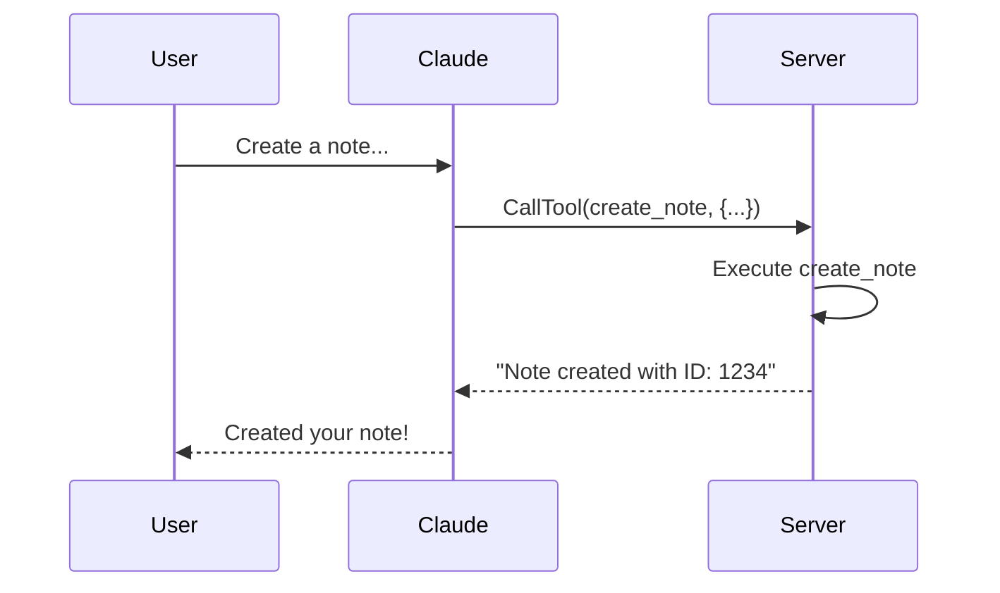
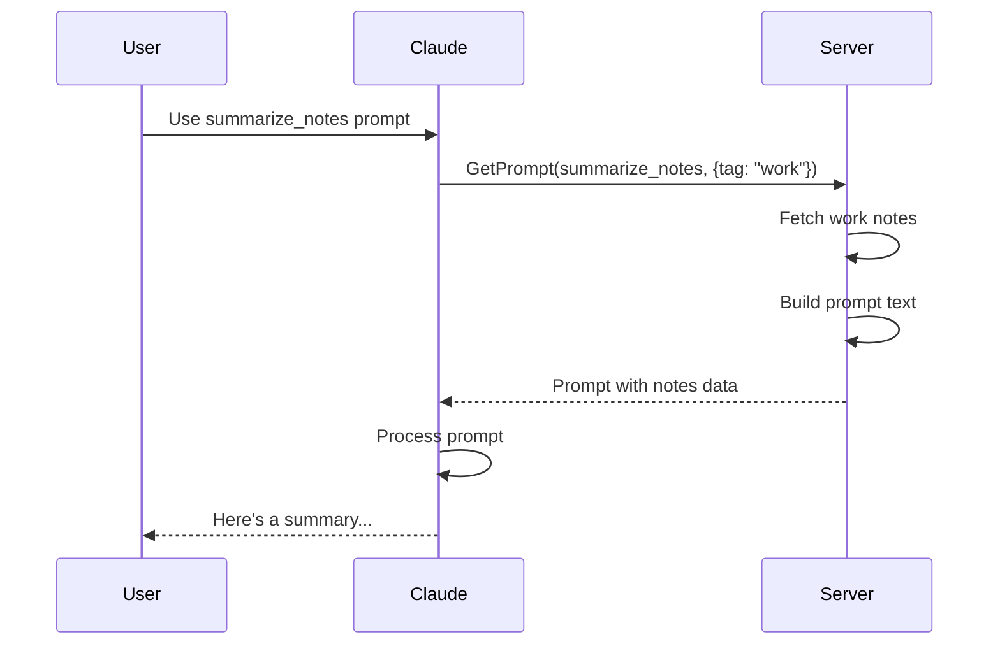
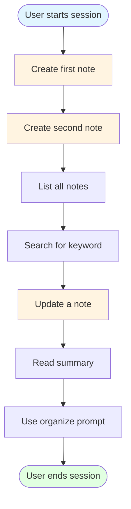

# MCP Usage Guide

This guide shows you how to use the Notes MCP Server in practice.

## 🚀 Setup

### 1. Install Dependencies

```bash
cd /path/to/mcp-server
npm install
```

### 2. Build the Server

```bash
npm run build
```

This compiles TypeScript to JavaScript in the `build/` directory.

### 3. Configure Your MCP Client

#### Claude Desktop

Edit your Claude Desktop configuration file:

**macOS**: `~/Library/Application Support/Claude/claude_desktop_config.json`
**Windows**: `%APPDATA%\Claude\claude_desktop_config.json`

```json
{
  "mcpServers": {
    "notes": {
      "command": "node",
      "args": ["/absolute/path/to/mcp-server/build/index.js"]
    }
  }
}
```

#### Custom MCP Client

See [examples/client-example.ts](../examples/client-example.ts) for a sample implementation.

### 4. Run in Inspect Mode (Browser UI)

Use MCP Inspector to run the server in introspect/inspect mode with a browser UI:

```bash
npm run inspect
```

What this does:
- Builds the server
- Starts MCP Inspector with your server command: `node build/index.js`
- Exposes a local UI (usually `http://127.0.0.1:6274`)

When Inspector starts, it prints:
- Proxy address (for example `127.0.0.1:6277`)
- A session auth token
- A URL with the token prefilled

Keep the terminal running while using the Inspector in your browser.

## 📝 Using Tools

### Create a Note

**Via Claude:**
```
User: Create a note titled "Meeting Notes" with content "Discuss Q1 goals" and tag it with "work"
```

**What happens:**


**Direct JSON-RPC:**
```json
{
  "jsonrpc": "2.0",
  "method": "tools/call",
  "params": {
    "name": "create_note",
    "arguments": {
      "title": "Meeting Notes",
      "content": "Discuss Q1 goals",
      "tags": ["work"]
    }
  },
  "id": 1
}
```

### List Notes

**Via Claude:**
```
User: Show me all my notes
```

```
User: Show me all notes tagged with "work"
```

**Direct JSON-RPC:**
```json
{
  "jsonrpc": "2.0",
  "method": "tools/call",
  "params": {
    "name": "list_notes",
    "arguments": {
      "tag": "work"
    }
  },
  "id": 2
}
```

**Response:**
```json
{
  "jsonrpc": "2.0",
  "result": {
    "content": [
      {
        "type": "text",
        "text": "[\n  {\n    \"id\": \"1234\",\n    \"title\": \"Meeting Notes\",\n    \"content\": \"Discuss Q1 goals\",\n    \"tags\": [\"work\"],\n    \"createdAt\": \"2026-02-18T10:00:00Z\",\n    \"updatedAt\": \"2026-02-18T10:00:00Z\"\n  }\n]"
      }
    ]
  },
  "id": 2
}
```

### Update a Note

**Via Claude:**
```
User: Update note 1234 to add "Review budget" to the content
```

**Direct JSON-RPC:**
```json
{
  "jsonrpc": "2.0",
  "method": "tools/call",
  "params": {
    "name": "update_note",
    "arguments": {
      "id": "1234",
      "content": "Discuss Q1 goals\nReview budget"
    }
  },
  "id": 3
}
```

### Search Notes

**Via Claude:**
```
User: Search my notes for "budget"
```

**Direct JSON-RPC:**
```json
{
  "jsonrpc": "2.0",
  "method": "tools/call",
  "params": {
    "name": "search_notes",
    "arguments": {
      "query": "budget"
    }
  },
  "id": 4
}
```

### Delete a Note

**Via Claude:**
```
User: Delete note 1234
```

**Direct JSON-RPC:**
```json
{
  "jsonrpc": "2.0",
  "method": "tools/call",
  "params": {
    "name": "delete_note",
    "arguments": {
      "id": "1234"
    }
  },
  "id": 5
}
```

## 📊 Using Resources

### Read All Notes

**Via Claude:**
```
User: Show me the raw data for all notes
```

**Direct JSON-RPC:**
```json
{
  "jsonrpc": "2.0",
  "method": "resources/read",
  "params": {
    "uri": "notes://all"
  },
  "id": 6
}
```

**Response:**
```json
{
  "jsonrpc": "2.0",
  "result": {
    "contents": [
      {
        "uri": "notes://all",
        "mimeType": "application/json",
        "text": "[{\"id\":\"1234\",\"title\":\"Meeting Notes\",...}]"
      }
    ]
  },
  "id": 6
}
```

### Read Summary

**Via Claude:**
```
User: Give me a summary of my notes
```

**Direct JSON-RPC:**
```json
{
  "jsonrpc": "2.0",
  "method": "resources/read",
  "params": {
    "uri": "notes://summary"
  },
  "id": 7
}
```

**Response:**
```json
{
  "jsonrpc": "2.0",
  "result": {
    "contents": [
      {
        "uri": "notes://summary",
        "mimeType": "text/plain",
        "text": "Notes Summary\n=============\nTotal notes: 5\nUnique tags: 3\nTags: work, personal, ideas"
      }
    ]
  },
  "id": 7
}
```

## 💬 Using Prompts

### Summarize Notes

**Via Claude:**
```
User: Use the summarize_notes prompt for my work notes
```

**What happens:**


**Direct JSON-RPC:**
```json
{
  "jsonrpc": "2.0",
  "method": "prompts/get",
  "params": {
    "name": "summarize_notes",
    "arguments": {
      "tag": "work"
    }
  },
  "id": 8
}
```

**Response:**
```json
{
  "jsonrpc": "2.0",
  "result": {
    "messages": [
      {
        "role": "user",
        "content": {
          "type": "text",
          "text": "Please summarize the following notes tagged with \"work\":\n\n- Meeting Notes: Discuss Q1 goals\n- Budget Review: Annual budget planning"
        }
      }
    ]
  },
  "id": 8
}
```

### Organize Notes

**Via Claude:**
```
User: Help me organize my notes
```

**Direct JSON-RPC:**
```json
{
  "jsonrpc": "2.0",
  "method": "prompts/get",
  "params": {
    "name": "organize_notes"
  },
  "id": 9
}
```

## 🔄 Complete Workflow Example

Let's walk through a complete user workflow:



### Step-by-Step

**1. Create notes**
```
User: Create a note "Project Ideas" with content "Build an MCP server" tagged "work"
User: Create a note "Grocery List" with content "Milk, eggs, bread" tagged "personal"
```

**2. List notes**
```
User: Show me all my notes
```

**3. Search**
```
User: Search for notes about "MCP"
```

**4. Update**
```
User: Add "Learn TypeScript" to the Project Ideas note
```

**5. Get summary**
```
User: What's my notes summary?
```

**6. Organize**
```
User: Help me organize my notes
```

## 🛠️ Testing with curl (Advanced)

You can test the server directly using stdio:

```bash
# Build the server
npm run build

# Send a request
echo '{"jsonrpc":"2.0","method":"tools/list","id":1}' | node build/index.js
```

## 🐛 Debugging

### Enable Verbose Logging

Modify [src/index.ts](../src/index.ts):

```typescript
// Add at the start of main()
process.env.DEBUG = '*';
```

### Common Issues

**Issue**: Server not responding
**Solution**: Check that the path in your MCP client config is correct

**Issue**: Tool not found
**Solution**: Run `ListTools` to see available tools

**Issue**: Invalid parameters
**Solution**: Check the inputSchema for required fields

## 📈 Performance Tips

### For Large Note Collections

1. **Implement pagination** in list_notes
2. **Add caching** for frequently accessed resources
3. **Use database** instead of in-memory storage
4. **Index** notes for faster search

### Example: Adding Pagination

```typescript
{
  name: "list_notes",
  inputSchema: {
    type: "object",
    properties: {
      tag: { type: "string" },
      limit: { type: "number", default: 10 },
      offset: { type: "number", default: 0 }
    }
  }
}
```

## 🔐 Security Best Practices

### Input Validation

```typescript
function validateNoteInput(args: any) {
  if (typeof args.title !== 'string' || args.title.length > 200) {
    throw new Error('Invalid title');
  }
  if (typeof args.content !== 'string' || args.content.length > 10000) {
    throw new Error('Invalid content');
  }
  // Sanitize tags
  if (args.tags) {
    args.tags = args.tags.filter((tag: string) =>
      typeof tag === 'string' && tag.length <= 50
    );
  }
}
```

### Rate Limiting

```typescript
const rateLimiter = new Map<string, number>();

function checkRateLimit(clientId: string): boolean {
  const now = Date.now();
  const lastCall = rateLimiter.get(clientId) || 0;

  if (now - lastCall < 1000) {  // 1 request per second
    return false;
  }

  rateLimiter.set(clientId, now);
  return true;
}
```

## 🎓 Next Steps

1. **Extend the server**: Add new tools like `export_notes`, `import_notes`
2. **Add persistence**: Replace Map with SQLite or PostgreSQL
3. **Add authentication**: Implement user-based access control
4. **Create a client**: Build a custom MCP client application
5. **Explore integrations**: Connect to other services (GitHub, Notion, etc.)

## 📚 Additional Examples

Check the [examples/](../examples/) directory for:
- Custom MCP client implementation
- Advanced tool patterns
- Resource streaming
- Prompt composition

---

**Have questions?** Review the [concepts](concepts.md) or [architecture](architecture.md) docs!
