# MCP Learning Journey - Visual Guide

This document provides a visual learning journey through the Model Context Protocol.

## 🌟 The Big Picture

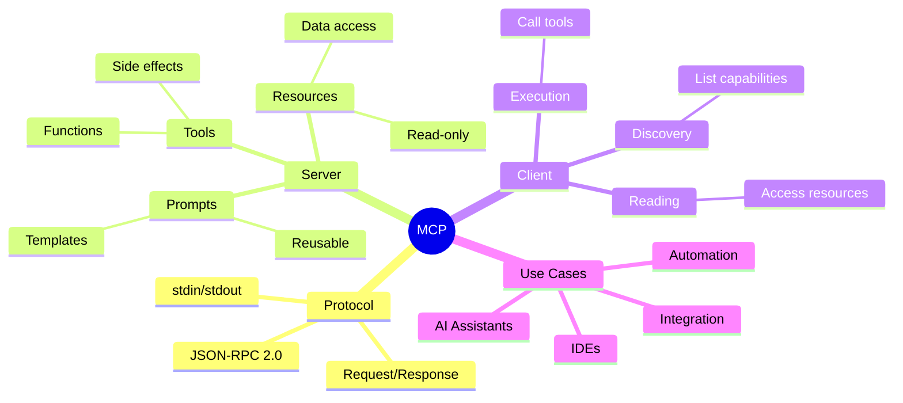

## 📊 Learning Path Flow

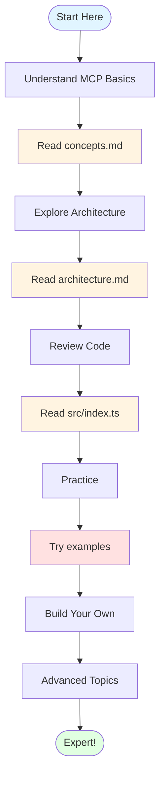

## 🎯 Understanding the Request Lifecycle

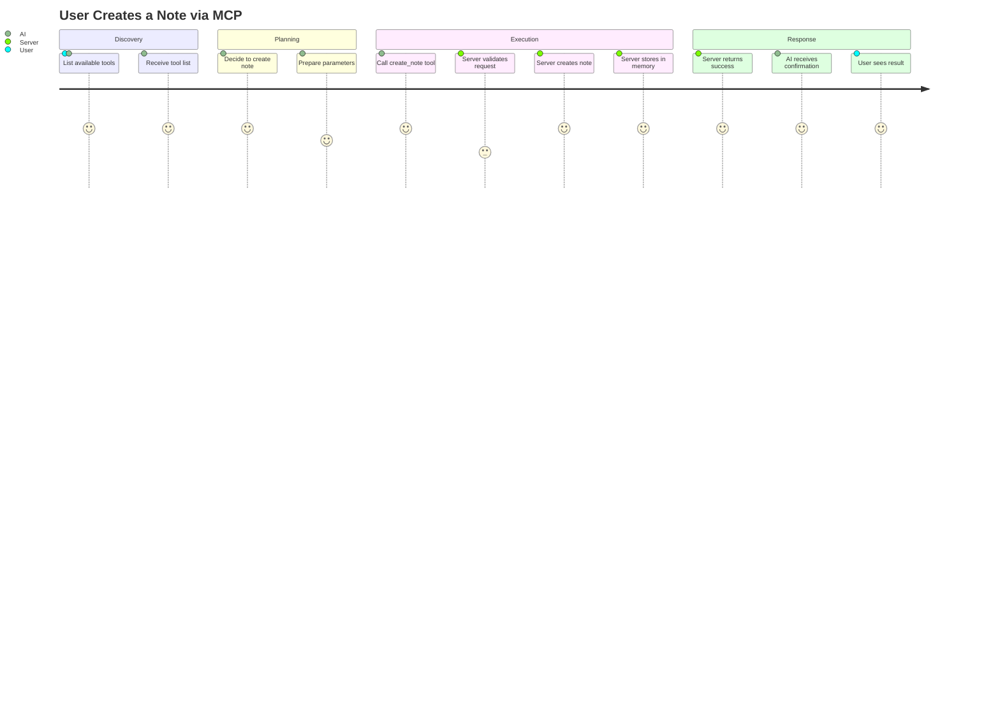

## 🔄 State Machine View

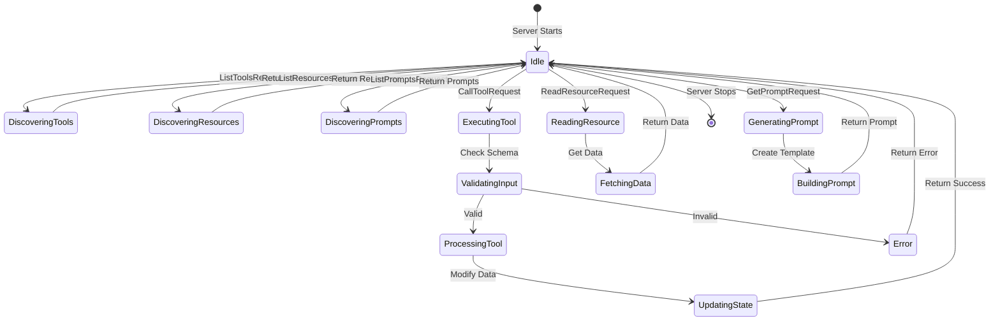

## 🏗️ Component Interaction Map

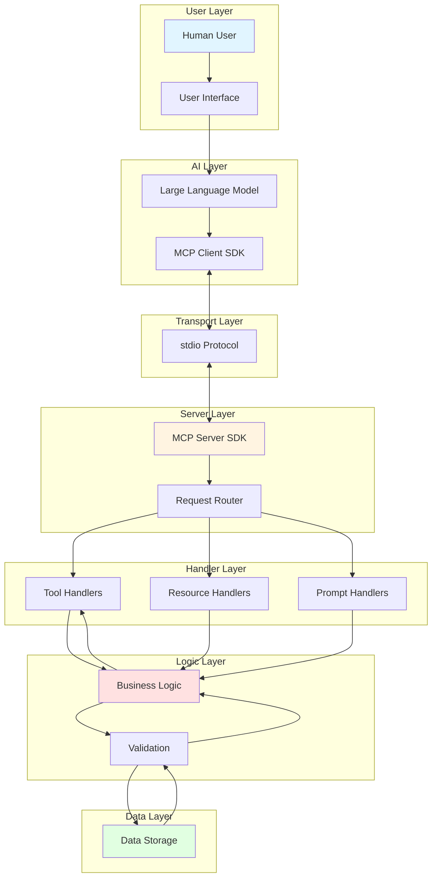

## 📈 Capability Matrix

```mermaid
quadrantChart
    title MCP Server Capabilities
    x-axis Low Complexity --> High Complexity
    y-axis Static --> Dynamic
    quadrant-1 Advanced Tools
    quadrant-2 Smart Prompts
    quadrant-3 Simple Resources
    quadrant-4 CRUD Tools
    create_note: [0.3, 0.7]
    update_note: [0.4, 0.8]
    search_notes: [0.6, 0.9]
    list_notes: [0.2, 0.6]
    notes://all: [0.1, 0.3]
    notes://summary: [0.3, 0.4]
    summarize_notes: [0.7, 0.5]
    organize_notes: [0.8, 0.6]
```

## 🎨 Design Patterns Overview

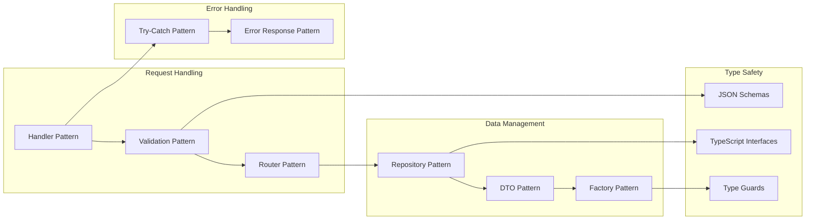

## 🔐 Security Layers

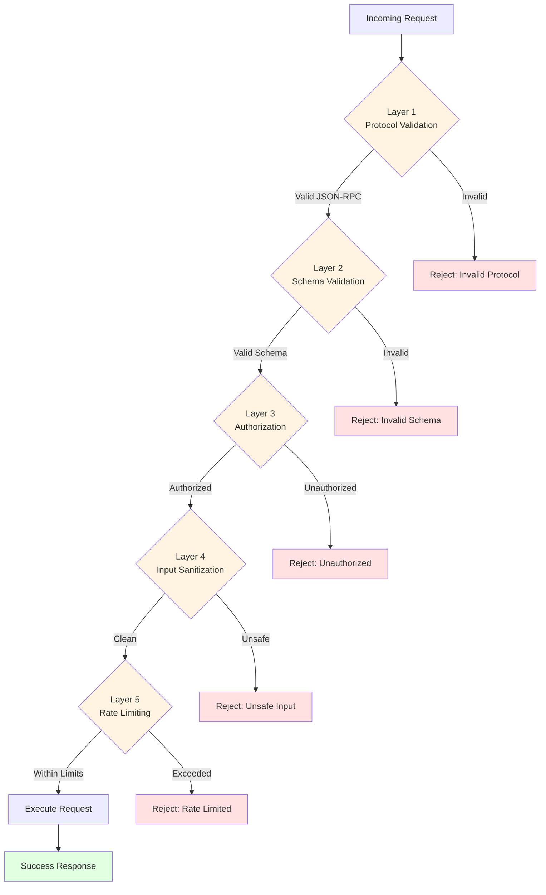

## 🎯 Tool Execution Timeline

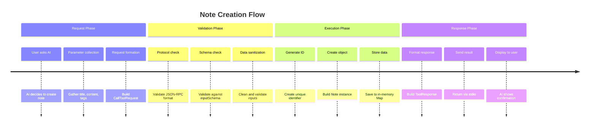

## 🚀 Scaling Evolution

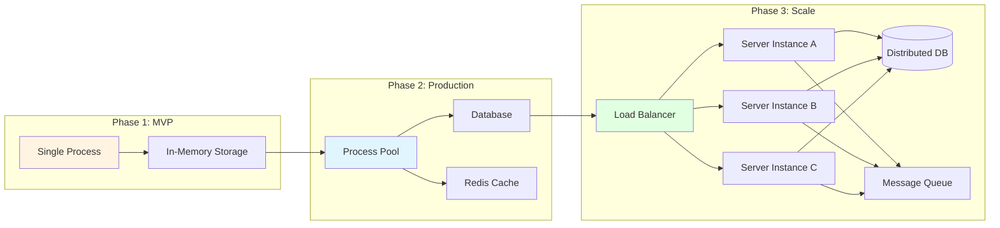

## 🧠 Mental Model

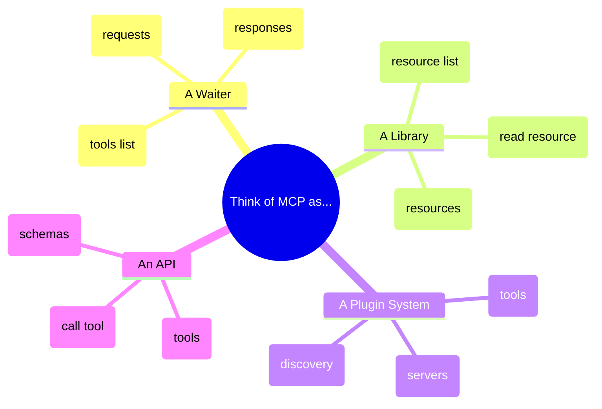

## 📚 Concept Hierarchy

```mermaid
graph TD
    MCP[Model Context Protocol] --> ServerSide[Server Side]
    MCP --> ClientSide[Client Side]
    MCP --> Protocol[Protocol Layer]

    ServerSide --> Implement[Implementation]
    ServerSide --> Expose[Exposure]

    ClientSide --> Discover[Discovery]
    ClientSide --> Consume[Consumption]

    Protocol --> Transport[Transport]
    Protocol --> Format[Message Format]

    Implement --> ImplTools[Implement Tools]
    Implement --> ImplResources[Implement Resources]
    Implement --> ImplPrompts[Implement Prompts]

    Expose --> ExposeTools[Expose via ListTools]
    Expose --> ExposeResources[Expose via ListResources]
    Expose --> ExposePrompts[Expose via ListPrompts]

    Discover --> DiscoverTools[List Available Tools]
    Discover --> DiscoverResources[List Available Resources]
    Discover --> DiscoverPrompts[List Available Prompts]

    Consume --> ConsumeTools[Call Tools]
    Consume --> ConsumeResources[Read Resources]
    Consume --> ConsumePrompts[Get Prompts]

    Transport --> STDIO[stdio]
    Transport --> HTTP[HTTP SSE]

    Format --> JSONRPC[JSON-RPC 2.0]
    Format --> Schema[JSON Schema]

    style MCP fill:#fff4e1
    style ServerSide fill:#e1f5ff
    style ClientSide fill:#e1ffe1
    style Protocol fill:#ffe1f5
```

---

**This visual guide complements the text documentation. Use it to:**
- Understand relationships between concepts
- See the flow of data and control
- Plan your own MCP implementations
- Teach others about MCP

**Tip**: Open this file in a Markdown viewer that supports Mermaid diagrams (like GitHub, VS Code with plugins, or dedicated Markdown apps) to see the full visualizations!
